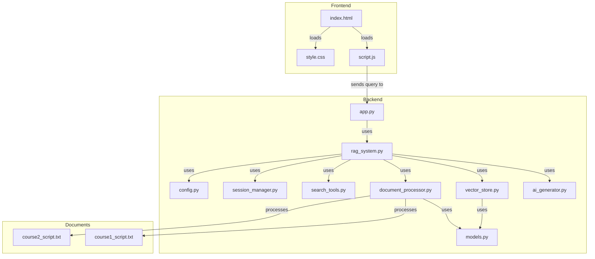

# Project Details: RAG Chatbot

This document provides a detailed breakdown of the RAG (Retrieval-Augmented Generation) chatbot project, including the role of each file and how they connect to form a complete application.

## High-Level Overview

The project is a chatbot that answers questions about a set of course materials. It uses a Retrieval-Augmented Generation (RAG) architecture, which means it retrieves relevant information from a knowledge base before generating an answer. This approach allows the chatbot to provide more accurate and context-aware responses than a standard language model.

The application is composed of three main parts:

1.  **Frontend:** A web-based user interface for interacting with the chatbot.
2.  **Backend:** A Python server that handles the core logic of the RAG system.
3.  **Documents:** The source material that the chatbot uses to answer questions.

## Architecture Diagram

## File-by-File Breakdown

### Root Directory (`starting-ragchatbot-codebase/`)

*   **`.env`**: This file stores environment variables, such as your `GEMINI_API_KEY`. It is not committed to version control and must be created locally.
*   **`.env.example`**: An example file showing what variables are needed in the `.env` file.
*   **`.gitignore`**: Specifies which files and directories should be ignored by Git (e.g., `.venv`, `__pycache__`).
*   **`.python-version`**: Specifies the Python version to be used for this project.
*   **`main.py`**: The entry point for the application. It imports and runs the FastAPI application from `backend/app.py`.
*   **`pyproject.toml`**: A configuration file for Python packaging and dependency management. It lists the project's dependencies.
*   **`README.md`**: The main documentation for the project.
*   **`run.sh`**: A shell script that sets up the environment and runs the application. It creates a virtual environment, installs dependencies, and starts the backend server.
*   **`uv.lock`**: A lock file that ensures reproducible builds by pinning the exact versions of all dependencies.

### Backend (`starting-ragchatbot-codebase/backend/`)

The backend is the core of the application and contains all the logic for the RAG system.

*   **`app.py`**: This is the main file for the backend server. It uses the FastAPI framework to create a web server and define the API endpoints.
    *   **Connections:**
        *   Imports `RAGSystem` from `rag_system.py` to handle the core logic.
        *   Defines the `/api/query` endpoint, which receives user queries from the frontend.
        *   Serves the frontend files from the `frontend/` directory.

*   **`config.py`**: This file defines a `Config` class that holds all the configuration settings for the application, such as API keys, model names, and database paths.
    *   **Connections:**
        *   Used by `rag_system.py` to configure the various components of the RAG system.

*   **`document_processor.py`**: This component is responsible for processing the raw course documents. It reads the files, cleans the text, and splits it into smaller, overlapping chunks.
    *   **Connections:**
        *   Used by `rag_system.py` to process the documents in the `docs/` directory.

*   **`models.py`**: This file defines the data models for the application, such as `Course`, `Lesson`, and `CourseChunk`. These models provide a structured way to represent the data.
    *   **Connections:**
        *   Used by `document_processor.py` and `rag_system.py` to create and manage course data.

*   **`rag_system.py`**: This is the central orchestrator of the RAG system. It initializes and coordinates all the other backend components.
    *   **Connections:**
        *   Imports and uses `DocumentProcessor`, `VectorStore`, `AIGenerator`, `SessionManager`, and `ToolManager`.
        *   The `query` method is the main entry point for processing a user's question.

*   **`search_tools.py`**: This file defines the "tools" that the AI model can use to interact with the RAG system. In this case, it defines a `CourseSearchTool` that allows the AI to search the vector store for relevant information.
    *   **Connections:**
        *   Used by `rag_system.py` to provide the AI with search capabilities.

*   **`session_manager.py`**: This component manages the conversation history for each user session. This allows the chatbot to have a memory of the conversation and provide more context-aware responses.
    *   **Connections:**
        *   Used by `rag_system.py` to store and retrieve conversation history.

*   **`vector_store.py`**: This component manages the vector database (ChromaDB). It stores the document chunks as vector embeddings and provides a way to search for the most relevant chunks based on a user's query.
    *   **Connections:**
        *   Used by `rag_system.py` to store and retrieve document chunks.

### Documents (`starting-ragchatbot-codebase/docs/`)

This directory contains the source material for the chatbot. The `document_processor.py` component reads the files in this directory and processes them into the vector store.

*   **`course1_script.txt`, `course2_script.txt`, etc.**: These are the raw text files containing the course materials.

### Frontend (`starting-ragchatbot-codebase/frontend/`)

The frontend is a simple web interface for interacting with the chatbot.

*   **`index.html`**: The main HTML file for the frontend. It defines the structure of the chat interface.
*   **`script.js`**: This file contains the JavaScript code that handles the user interaction. It sends the user's query to the backend's `/api/query` endpoint and displays the response in the chat window.
*   **`style.css`**: This file contains the CSS styles for the frontend.

## How the RAG Bot Works: The Complete Flow

1.  **Startup:**
    *   You run the `run.sh` script.
    *   The script creates a virtual environment and installs the dependencies listed in `pyproject.toml`.
    *   The `main.py` script is executed, which starts the FastAPI server defined in `backend/app.py`.
    *   During startup, the `RAGSystem` in `rag_system.py` is initialized. It reads the documents from the `docs/` directory, processes them using the `DocumentProcessor`, and stores them in the ChromaDB vector store via the `VectorStore`.

2.  **User Interaction:**
    *   You open `http://127.0.0.1:8000` in your browser, which loads the `index.html` file.
    *   You type a question into the chat window and press "send."
    *   The `script.js` file sends your question as a POST request to the `/api/query` endpoint on the backend.

3.  **Backend Processing:**
    *   The `/api/query` endpoint in `app.py` receives the request and calls the `query` method in `rag_system.py`.
    *   The `RAGSystem` was originally designed to use the `CourseSearchTool` to search the `VectorStore` for the most relevant document chunks related to your query.
    *   The retrieved chunks are then passed along with your original query to the `AIGenerator`.
    *   The `AIGenerator` sends the combined information to the Gemini API.
    *   The Gemini API generates a response based on the provided context.

4.  **Response:**
    *   The `AIGenerator` returns the response to the `RAGSystem`.
    *   The `RAGSystem` returns the response to the `app.py` endpoint.
    *   The `app.py` endpoint sends the response back to the frontend.
    *   The `script.js` file receives the response and displays it in the chat window.

This entire process, from retrieving relevant information to generating a response, is what makes this a Retrieval-Augmented Generation chatbot.

## How RAG Works: A Deeper Dive

The core of this application is the Retrieval-Augmented Generation (RAG) process. Here's a more detailed explanation of how it works:

### 1. The "Retrieval" Step: Finding Relevant Information

The "Retrieval" part of RAG is all about finding the most relevant information from the course documents to help answer the user's question. This is done using a vector store and semantic search.

*   **Embeddings:** When the application starts, the `DocumentProcessor` reads the course documents and breaks them down into smaller chunks. Each of these chunks is then converted into a numerical representation called a "vector embedding." This is done using a special AI model (in this case, `all-MiniLM-L6-v2`) that is trained to understand the meaning of text. The resulting vector is a long list of numbers that captures the semantic meaning of the chunk.

*   **Vector Store:** All of these vector embeddings are stored in a special database called a "vector store" (ChromaDB in this project). The vector store is optimized for searching through these numerical representations.

*   **Semantic Search:** When you ask a question, your query is also converted into a vector embedding using the same AI model. The vector store then compares the vector of your query to the vectors of all the document chunks it has stored. It looks for the chunks whose vectors are "closest" to the query's vector in a high-dimensional space. This "closeness" indicates that the chunks are semantically similar to your question, even if they don't use the exact same words.

### 2. The "Augmentation" Step: Building a Better Prompt

Once the most relevant document chunks have been retrieved from the vector store, they are "augmented" to the original query. This means they are combined with your question to create a new, more detailed prompt for the language model.

For example, if you ask, "What is the main idea of the first course?", the RAG system might retrieve the following chunks:

*   "The first course, 'Advanced Retrieval for AI with Chroma,' focuses on..."
*   "A key concept in this course is the use of vector embeddings for..."
*   "Students will learn how to build a semantic search engine using..."

These chunks are then combined with your original question to form a prompt that looks something like this:

> **User Question:** What is the main idea of the first course?
>
> **Retrieved Context:**
> *   "The first course, 'Advanced Retrieval for AI with Chroma,' focuses on..."
> *   "A key concept in this course is the use of vector embeddings for..."
> *   "Students will learn how to build a semantic search engine using..."
>
> **Please answer the user's question based on the provided context.**

### 3. The "Generation" Step: Creating the Answer

This augmented prompt is then sent to the large language model (in this case, Gemini). The LLM now has much more context to work with than just your original question. It can use the retrieved information to generate a more accurate and detailed answer.

Because the LLM is given the relevant information directly in the prompt, it is much less likely to make up information or "hallucinate." It can base its answer on the facts provided in the course documents.

This combination of retrieval and generation is what makes RAG so powerful. It allows the chatbot to leverage the vast knowledge of a large language model while still being grounded in the specific information contained in your documents.